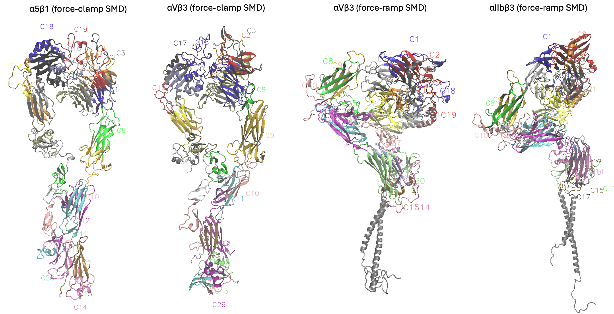
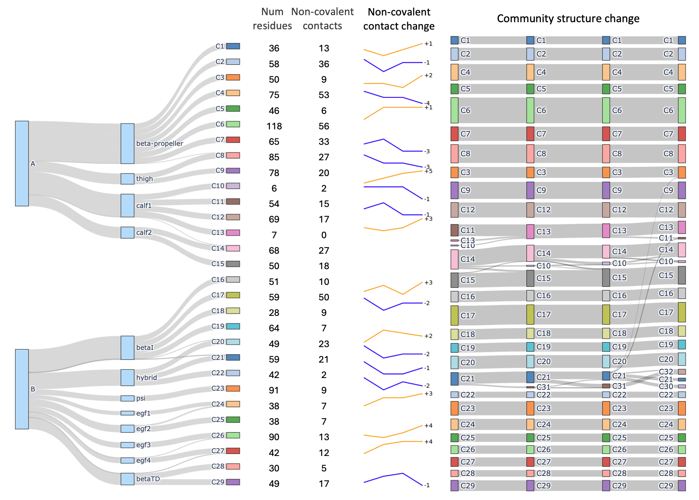

# Analyzing Molecular Dynamics Simulations of Protein Conformational Change Using Dynamic Molecular Community Detection (DynMoCo)

## Overview

DynMoCo is a deep learning framework for end-to-end dynamic community detection on molecular graphs. Given a molecular dynamics (MD) trajectory, DynMoCo identifies spatially grounded substructures that move together during conformational changes, tracks their evolution over time, and can incorporate structural knowledge to ensure physically meaningful communities. The model uses:
- **Graph Convolutional Networks (GCNs)** for feature extraction from molecular structures
- **Deep Modularity Networks (DMoN)** for community detection optimization
- **Temporal evolution** through GRU cells to track community changes over time
- **Multiple regularization terms** including collapse, knowledge, and sparsity regularization

The framework has been applied to integrin proteins under different mechanical conditions (force-clamp and force-ramp simulations) to understand how molecular communities reorganize during mechanical stress.



## Key Features

This repository contains:
- **Original implementation of DynMoCo** - The main dynamic community detection framework
- **Benchmark implementations** - Other deep learning community detection methods including DEC, DiffPool, DMON, DynamicGem, and MFC-TopoReg (see `notebooks/`)
- **Interactive visualization in VMD** - Scripts for visualizing communities in VMD (see `VMD scripts/`)
- **Molecular dynamics datasets** - Pre-processed integrin protein trajectories under mechanical stress

## Repository Structure

```
DynMoCo/
├── models/                  # Model implementations
│   ├── dynmoco.py           # Main DynMoCo model
│   ├── dec.py               # Deep Embedding Clustering
│   ├── diffpool.py          # DiffPool implementation
│   └── ...
├── layers/                  # Neural network layers
│   ├── gcn.py               # Graph Convolutional Networks
│   ├── dmon.py              # Deep Modularity Networks
│   ├── hgru.py              # Hierarchical GRU cells
│   └── ...
├── training/                # Training scripts
│   ├── train_dynmoco.py     # DynMoCo training
│   └── ...
├── processor/               # Data processing utilities
│   ├── data.py              # Data loading and preprocessing
│   ├── graph.py             # Graph construction
│   └── ...
├── utils/                    # Utility functions
│   ├── clustering.py        # Clustering algorithms
│   ├── metrics.py           # Evaluation metrics
│   ├── visualization.py     # Plotting utilities
│   └── ...
├── data/                     # Molecular dynamics datasets
│   ├── a5b1 Clamp/           # α5β1 integrin force-clamp data
│   ├── aVb3 Clamp/           # αVβ3 integrin force-clamp data
│   ├── alpha2bbeta3 Ramp/    # αIIbβ3 integrin force-ramp data
│   └── alphaVbeta3 Ramp/     # αVβ3 integrin force-ramp data
├── communities/              # Community detection results by dynmoco
│   ├── a5b1_clamp_communities.json
│   └── ...
├── results/                  # Training and evaluation results
│   ├── dynmoco/              # DynMoCo results
│   └── ...
├── VMD scripts/              # Visualization scripts
│   ├── json_to_tcl.py       # Convert JSON to VMD TCL
│   ├── aIIbb3_example.tcl   # Example VMD script
│   └── ...
└── notebooks/                # Jupyter notebooks for analysis
    ├── dynmoco.ipynb        # DynMoCo analysis
    └── ...
```


## Installation

### Prerequisites
- Python 3.7+
- PyTorch 1.9.0+
- CUDA (optional, for GPU acceleration)
- VMD (Visual Molecular Dynamics) software (for visualization)

### Dependencies

Install the required packages:

```bash
pip install -r requirements.txt
```

## How to Train DynMoCo

The main training function is located in `training/train_dynmoco.py`. Here's how to use it:

```python
# Train the model
communities, model = train(
    dataloader=dataloader,
    residue_indices=residue_indices,
    architecture=[64, 32],              # List of hidden layer dimensions for GCN layers
    n_clusters=40,                      # Max number of communities to detect
    collapse_regularization=0.2,        # Collapse loss weight
    knowledge_regularization=0.1,       # Knowledge loss weight
    sparsity_regularization=0.0,        # Sparsity loss weight
    activation = "gumbelhard",          # ac
    gumbel_tau=0.5,                     # Temperature for Gumbel-Softmax sampling
    dropout_rate=0.0,                   # Dropout rate
    n_epochs=3000,                      # Training epochs
    learning_rate=0.001,                # Learning rate
    initialization="louvain",           # Initialization method
    device="cuda" if torch.cuda.is_available() else "cpu",
    verbose=True
)
```

### Data Format
The model expects:
- **Structure files**: `.gro` or `.pdb` files containing static molecular structure
- **Trajectory files**: `.xtc` or `.dcd` files containing molecular dynamics trajectories
- **Domain information**: Provided as a dictionary or JSON file (optional) 

### Output
The training function returns:
- **`communities`**: Dictionary containing community assignments for each timestep
- **`model`**: Trained DynMoCo model

Community assignments are saved in JSON format (see examples in `communities/` folder):
```json
{
    "0": {
        "C1": [0, 1, 2, 3, ...],
        "C2": [4, 5, 6, 7, ...],
        ...
    },
    "1": {
        "C1": [0, 1, 2, 3, ...],
        "C2": [4, 5, 6, 7, ...],
        ...
    }
}
```

### Community Characterization and Analysis

See detailed community characterization and post-hoc analysis in `notebooks/dynmoco.ipynb`.



## Visualization with VMD

We provides custom scripts to visualize communities in 3D molecular structure in VMD (Visual Molecular Dynamics).

### Prerequisites

1. Install VMD from [https://www.ks.uiuc.edu/Research/vmd/](https://www.ks.uiuc.edu/Research/vmd/)
2. Ensure you have the community detection results in JSON format

### How to Visualize in VMD

See `VMD scripts/README_VMD.md`. 

## License

This project is licensed under the MIT License - see the LICENSE file for details.

## Contact

For questions or issues, please open an issue on GitHub or contact the maintainers.
